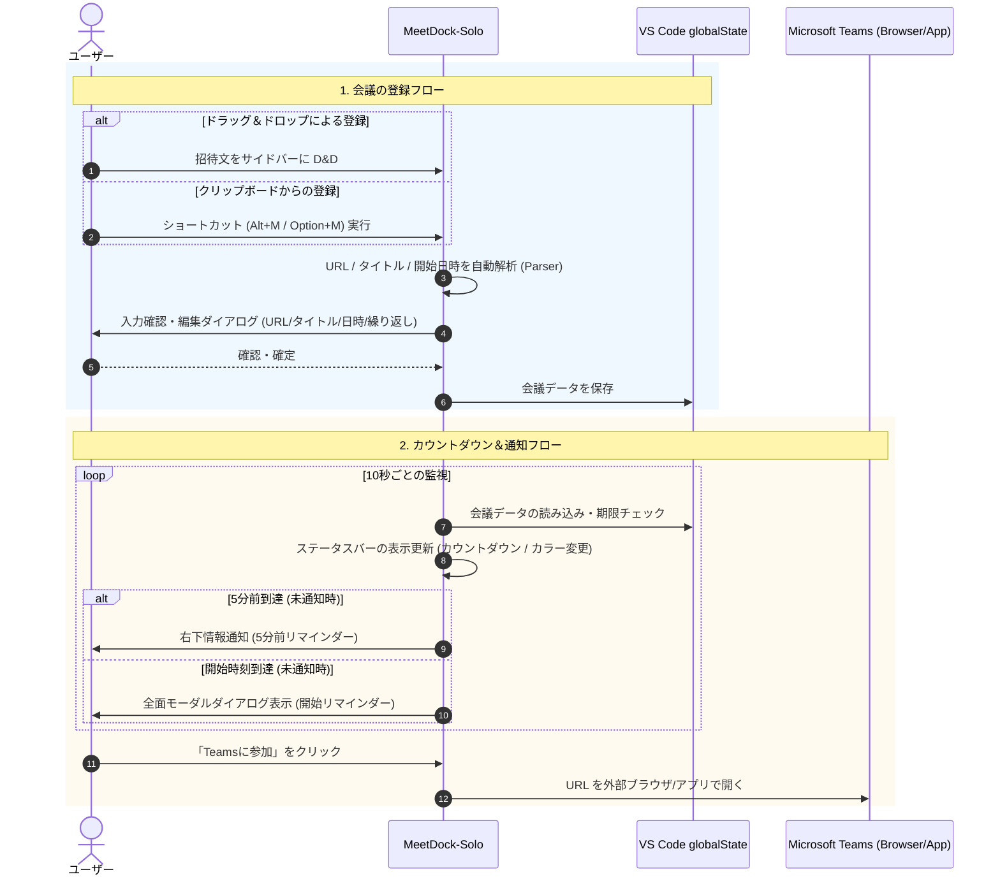
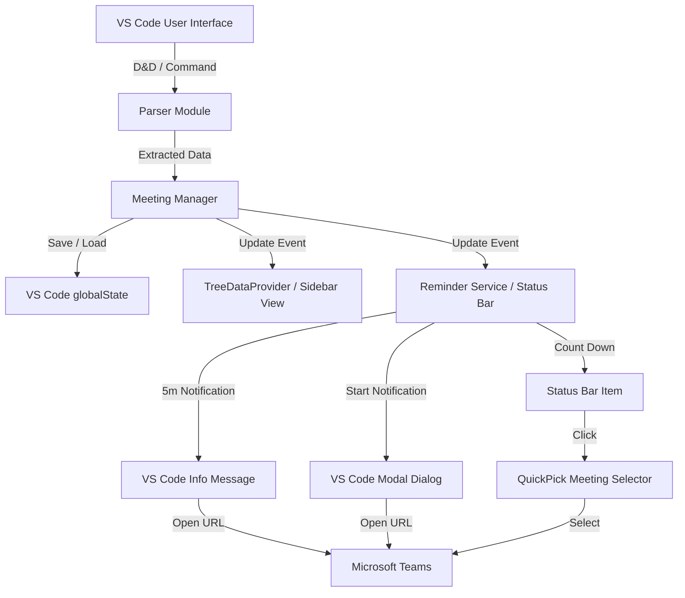

# MeetDock-Solo

**MeetDock-Solo** は、VS Code でのプログラミング作業中に Microsoft Teams 会議の参加漏れや遅刻を防ぐためのリマインダー＆会議一覧管理拡張機能です。

サイドバーへのドラッグ＆ドロップやショートカットキー（`Alt+M` / `Option+M`）によるクリップボード自動解析により、Teams 会議を迅速に登録できます。ステータスバーのリアルタイムカウントダウンと2段階のリマインダー通知（5分前ポップアップ・開始時のモーダル表示）で、コーディングに集中しながらも確実に会議へ参加できるようサポートします。

---

## 💡 主な機能

1. **直感的な会議登録**
   - **ドラッグ＆ドロップ**: メールやチャットの会議招待テキストをサイドバー（TreeView）にドラッグ＆ドロップするだけで、URL・タイトル・開始日時を自動抽出して登録できます。
   - **クリップボード解析 (`Alt+M` / `Option+M`)**: コピーしたテキストから自動解析し、入力ダイアログで迅速に登録できます。

2. **ステータスバー表示とリアルタイムカウントダウン**
   - 次の会議までの残り時間をステータスバーに常時表示します。
   - 残り時間に応じて表示スタイルが自動変化します：
     - **通常時**: `$(calendar) Next Teams: 14:00 (in 35m)`
     - **5分前〜1分前**: 黄色背景で警告表示 `(in 5m)`
     - **1分前未満**: 赤色背景で強調表示 `(まもなく開始)`
     - **開催中**: 黄色背景で `$(broadcast) Teams: 件名 (開催中)`
   - ステータスバーをクリックすると、登録済み会議の一覧（クイックピック）が開き、すぐに Teams へ参加できます。

3. **確実な2段階リマインダー通知**
   - **5分前通知**: VS Code 右下に通知ポップアップを表示。「Teamsに参加」ボタンを押すとブラウザまたはTeamsアプリで即座に会議リンクが開きます。
   - **開始時刻通知**: 画面前面に**モーダルダイアログ**を表示。コーディングに没頭していても見逃すことなく Teams へ参加できます。

4. **繰り返し（リカーレンス）会議の自動更新**
   - 会議ごとに繰り返し設定を選択可能：
     - **単発 (Once)**: 会議終了後に自動的に一覧から削除されます。
     - **毎週 (Weekly)**: 会議終了後、自動的に翌週の同日時に次回スケジュールが更新されます。
     - **平日 (Weekdays)**: 会議終了後、自動的に次の平日（月〜金）に次回スケジュールが更新されます。

5. **データ永続化 (`globalState`)**
   - 登録された会議データは VS Code の `globalState` に安全に保存され、エディタを再起動しても保持されます。

---

## 🔄 動作フロー・システム構造

### 会議登録・通知フロー (Mermaid Sequence Diagram)

### 機能コンポーネント構造 (Mermaid Flowchart)

---

## 🚀 使い方

### 1. 会議を登録する

#### 方法 A: サイドバーへドラッグ＆ドロップ
1. VS Code のアクティビティバーにあるカレンダーアイコン **MeetDock** を開きます。
2. Teams の会議URLを含むテキスト（メール本文、チャットメッセージ、Webページの選択テキストなど）をサイドバービュー（`MeetDock Meetings`）へドラッグ＆ドロップします。
3. 自動抽出された URL・件名・日時を確認し、必要に応じて修正して Enter キーを押します。
4. 繰り返し設定（`単発` / `毎週` / `平日`）を選択して登録完了です。

#### 方法 B: クリップボードから追加
1. Outlook や Teams 等で会議情報を含むテキストをコピー (`Ctrl+C` / `Cmd+C`) します。
2. キーボードショートカット `Alt+M` (macOS: `Option+M`) を押すか、サイドバー上部の `+` (追加) アイコンをクリックします。
3. 自動抽出された項目を確認・決定して登録完了です。

### 2. 会議に参加する
- **ステータスバーから**: ステータスバーの `Next Teams: ...` をクリックするとクイックピックが開き、参加したい会議を選択できます。
- **サイドバーから**: 会議項目の右側に表示される外部リンクアイコン（`Teamsに参加`）をクリックします。
- **通知から**: 5分前通知または開始時のモーダルダイアログに表示される **「Teamsに参加」** ボタンをクリックします。

### 3. 会議を管理・削除する
- **削除**: サイドバーの会議項目ホバー時に表示されるゴミ箱アイコン（`削除`）をクリックすると、登録を削除できます。
- **手動更新**: サイドバー上部の更新アイコンをクリックすると、表示を手動更新できます。

---

## ⌨️ コマンド & キーバインド

| コマンド名 | コマンド ID | ショートカットキー | 説明 |
| :--- | :--- | :--- | :--- |
| **クリップボードから会議を追加** | `meetdock-solo.addFromClipboard` | `Alt+M` (Win/Linux) `Option+M` (macOS) | クリップボードのテキストから Teams URL、件名、開始日時を解析して登録 |
| **Teamsに参加** | `meetdock-solo.openMeeting` | - | 選択された会議の URL をブラウザまたは Teams アプリで開く |
| **会議を削除** | `meetdock-solo.deleteMeeting` | - | 登録済みの会議を削除する |
| **更新** | `meetdock-solo.refreshView` | - | サイドバーの会議一覧表示を更新する |
| **ミーティング一覧から選択** | `meetdock-solo.selectMeeting` | - | クイックピックで登録済み会議一覧を表示し、選択して参加する |

---

## 📋 動作要件 (Requirements)

- **VS Code**: `v1.137.0` 以降
- **対応 OS**: Windows, macOS, Linux
- Microsoft Teams の会議 URL (`https://teams.microsoft.com/...` または `https://teams.live.com/...`) を使用する環境

---

## 🔒 データの保存について

本拡張機能で登録した会議情報は、外部サーバーに送信されることは一切ありません。すべてのデータは VS Code の `ExtensionContext.globalState` を通じてローカル環境に保存されます。

---

## 📄 ライセンス

[MIT License](LICENSE)
