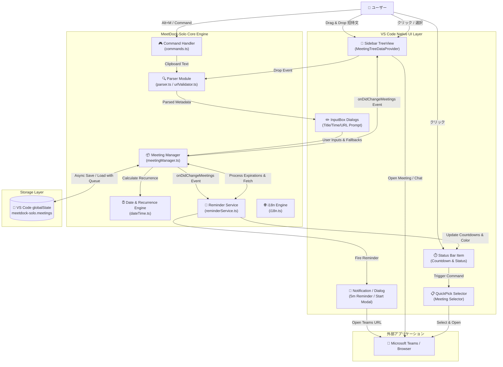
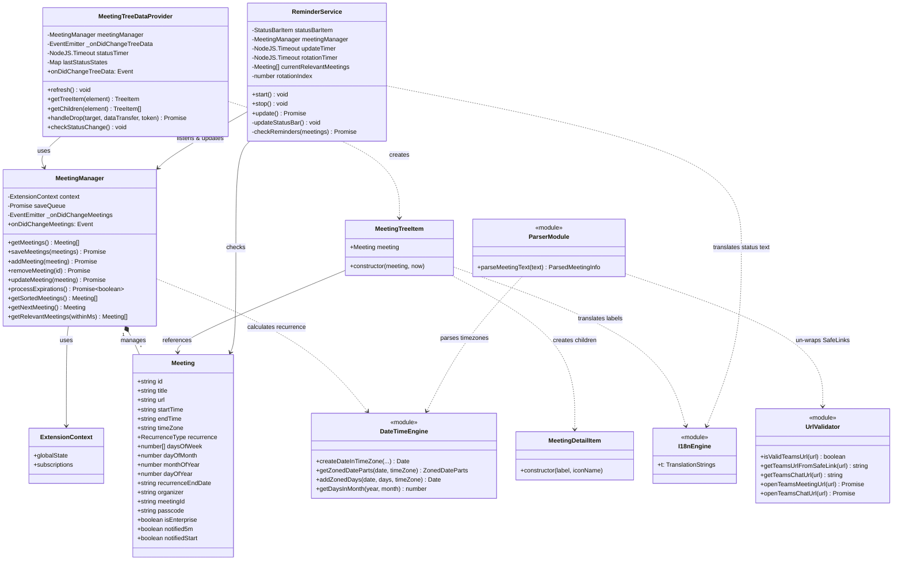
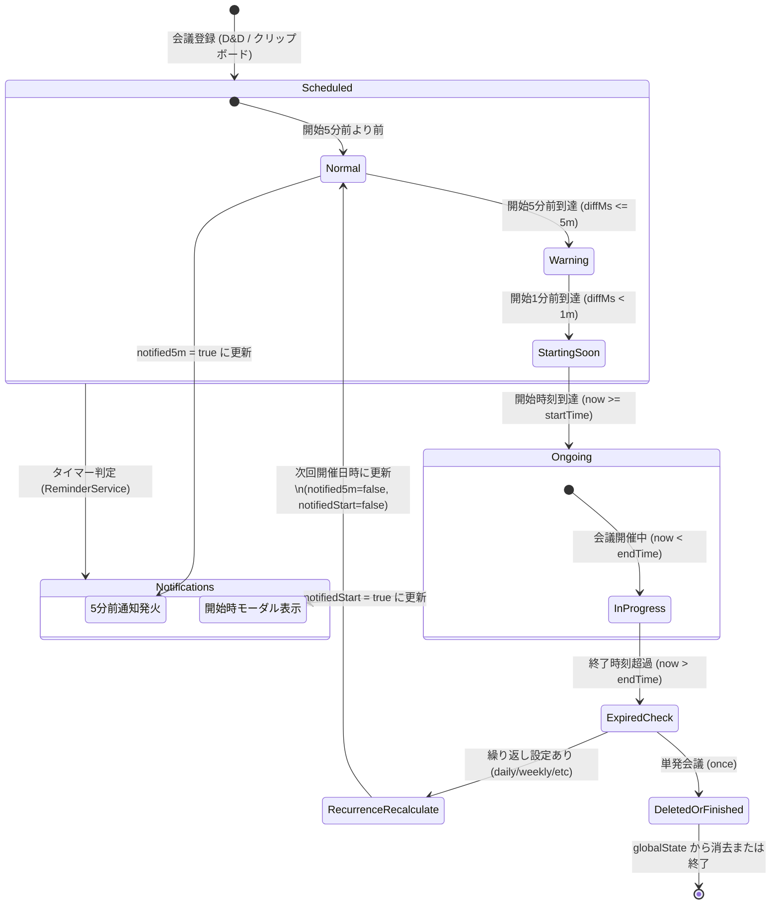
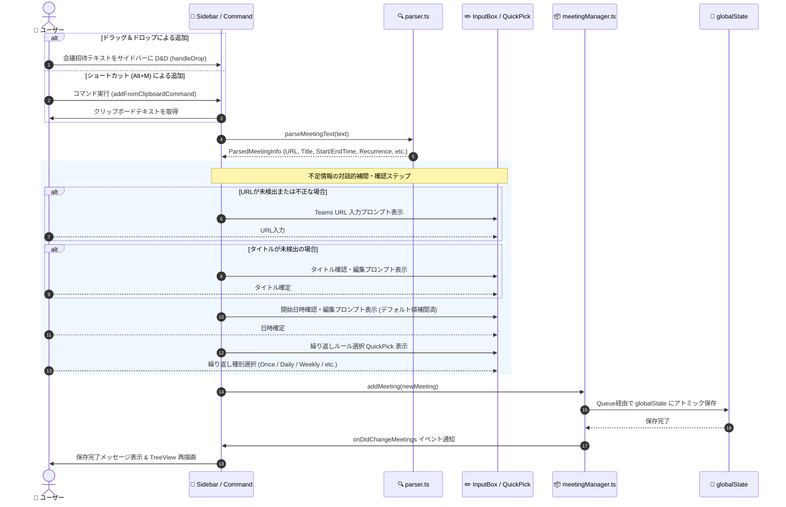
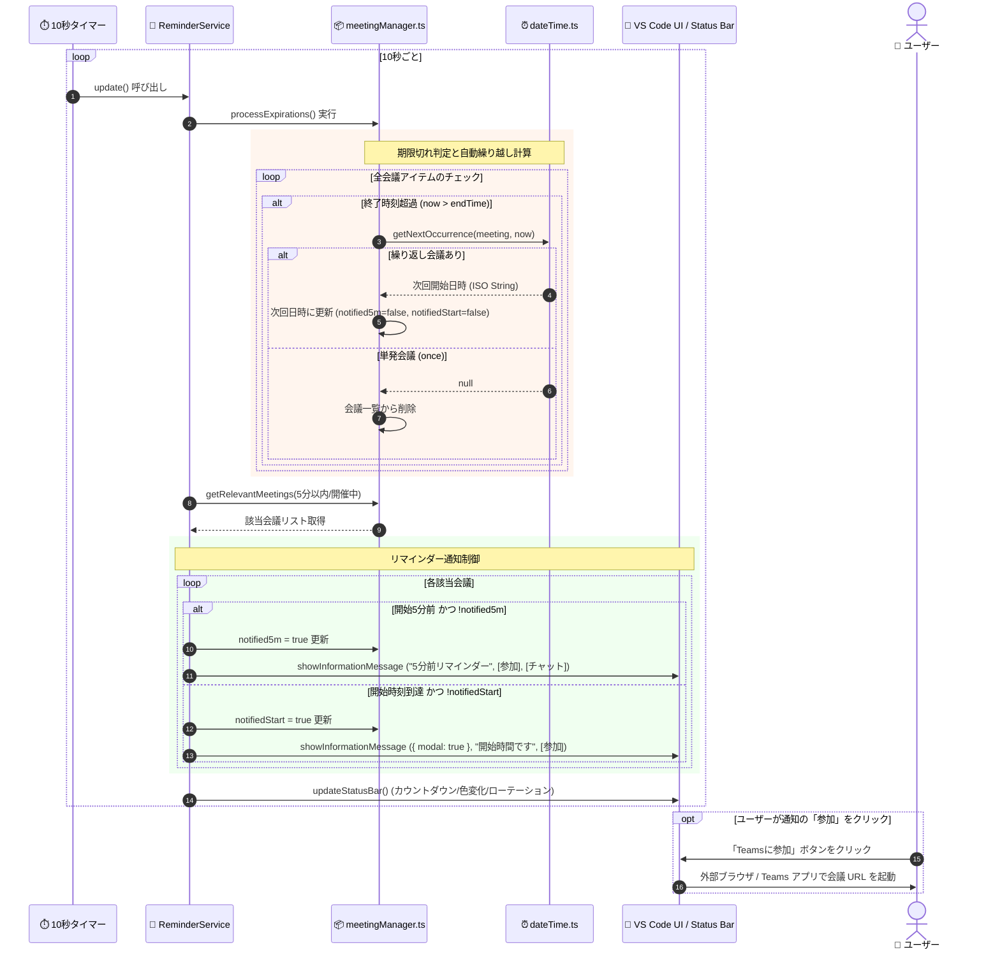
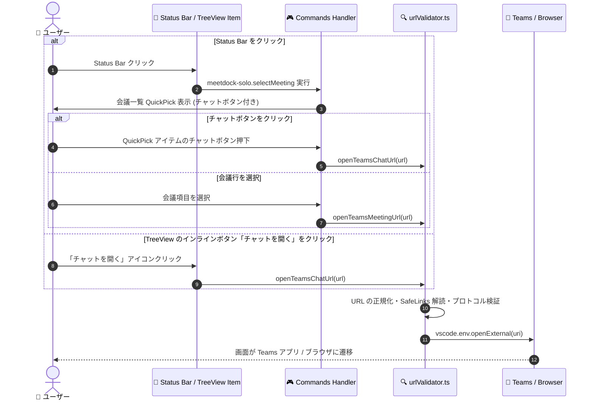

# アーキテクチャとシステム設計書 (Architecture & System Design)

このドキュメントは **MeetDock-Solo** の全体アーキテクチャ、設計思想、モジュール構成、データフロー、状態遷移および動的シーケンスを示す開発者・アーキテクト向けのドキュメントです。

---

## 1. 概要と成り立ち (Overview & Design Philosophy)

### 1.1 開発背景と成り立ち
コーディングや開発作業に集中している際、Microsoft Teams 等の会議開始時刻に気付かず遅刻・欠席してしまう問題を防ぐために **MeetDock-Solo** は誕生しました。

外部の重厚なカレンダー連携システムやクラウドAPI認証（OAuth）に依存せず、**「手軽に・軽量に・ローカル完結で」** 会議リマインダーを利用できることを最優先設計目標としています。

### 1.2 コア設計思想
1. **100% ローカルファースト & プライバシー保護**
   - クラウドサーバーや外部APIとの直接通信を行わず、すべての会議データは VS Code の `globalState` に暗号化/ローカル保存されます。
2. **VS Code Native UI の徹底活用**
   - Webview を用いず、VS Code 純正の `TreeView` (TreeDataProvider & TreeDragAndDropController) および `StatusBarItem`, `QuickPick` を活用することで、極めて軽量かつレスポンシブな動作を実現します。
3. **スマート解析と段階的補間 (Smart Parsing & Dynamic Interactive Interpolation)**
   - 招待文テキスト（クリップボードやD&D）から Teams URL、タイトル、開始/終了日時、主催者、会議ID/パスコード、繰り返し設定を自動抽出し、不足している情報のみを対話型ダイアログで補完します。
4. **マルチレベルのタイムリーなリマインド**
   - 5分前の情報通知 (Information Message)、開始時刻の全面ダイアログ (Modal Message)、および StatusBar のリアルタイムカウントダウン/ローテーション表示により見落としを防止します。

---

## 2. コンポーネント構成とデータフロー (Component Architecture & Data Flow)

### 2.1 コンポーネント構成図 (Component Diagram)

以下は、ユーザー入力・VS Code Native UI・内部コアモジュール・データ保存層・外部アプリケーション（Microsoft Teams）間の関係を示すコンポーネント図です。



### 2.2 ユーザー入力の格納場所と自動補間メカニズム

ユーザーが入力したデータやクリップボード/D&D経由で取得した情報は、以下の流れで解析・補間され、`globalState` に永続化されます。

```
[ ユーザー入力 / D&Dテキスト / クリップボード ]
                     │
                     ▼
       【 1. Parser による自動抽出 (parser.ts) 】
   - Outlook SafeLinks の自動解読・展開
   - Teams 会議 URL / 主催者 / 会議ID・パスコードの抽出
   - タイトル抽出 (Subject / 件名 / 招待文頭)
   - 日時・タイムゾーンの解析 (和暦・12/24時間表記対応)
   - 繰り返しパターン (Daily/Weekly/Monthly/Yearly/Weekdays) の判定
                     │
                     ▼
      【 2. 不足情報の補間・デフォルト計算 (commands.ts / treeProvider.ts) 】
   - URL未検出時 ──> URL入力プロンプトを表示
   - タイトル未検出時 ──> デフォルト 'Teams Meeting' を補間
   - 開始日時未検出時 ──> 翌毎時00分を補間
   - 過去日時の場合 ──> 次回開催予定日へ自動繰り越し補間
   - 終了日時未指定時 ──> 開始時刻 + 30分を補完計算
                     │
                     ▼
       【 3. 永続化と状態通知 (meetingManager.ts) 】
   - JSONオブジェクト構造に変換し globalState にアトミック保存
   - Change Event を発行し TreeView と StatusBar を同期更新
```

### 2.3 入力項目・補間ロジック一覧

| 項目名 | 抽出ソース (Parser) | 補間・デフォルト値ルール | 保存先フィールド (`Meeting`) |
| :--- | :--- | :--- | :--- |
| **URL** | `teams.microsoft.com/...` / Outlook SafeLinks | 未検出時は InputBox で手動入力を要求 (バリデーション必須) | `url` |
| **タイトル** | 件名 (`Subject:`) / 招待文の1行目 | 未検出時は `'Teams Meeting'` | `title` |
| **開始日時** | `YYYY-MM-DD HH:mm`, 和暦, 英語日付等 | 未検出時は「現在時刻の1時間後の毎時00分」。過去時刻は未来日へ繰り越し | `startTime` (ISO string) |
| **終了日時** | 時間範囲パターン (`10:00 - 11:00`) | 未検出時は `startTime + 30分` | `endTime` (ISO string) |
| **タイムゾーン** | 日時表記内の `(JST)`, `(PST)` 等 | 未指定時はシステムローカルタイムゾーン | `timeZone` |
| **繰り返し種別** | `毎日`, `毎週`, `平日`, `毎月`, `毎年` 等 | 未検出時は `'once'` (単発) | `recurrence` |
| **繰り返し詳細** | `○曜日`, `毎月○日`, `○月○日`, 終了日 | 解析結果に基づき設定。未指定時は開始日時の曜日/日付を使用 | `daysOfWeek`, `dayOfMonth`等 |
| **主催者名** | 招待メッセージヘッダー | 未検出時は undefined | `organizer` |
| **会議ID/パスコード**| `会議 ID: xxx`, `パスコード: yyy` | 未検出時は undefined | `meetingId`, `passcode` |
| **通知済フラグ** | 初期状態: `false` | 5分前通知済: `notified5m`, 開始通知済: `notifiedStart` | `notified5m`, `notifiedStart` |

---

## 3. モジュール構造とクラス設計 (Module Architecture & Class Diagram)

### 3.1 クラス・モジュール関係図 (Class Diagram)

MeetDock-Solo の主要クラスおよび各モジュール間の依存関係を示すクラス図です。



### 3.2 モジュール責務一覧

| モジュールファイル | 主要クラス / 関数 | 主な責務・役割 |
| :--- | :--- | :--- |
| **`src/extension.ts`** | `activate()`, `deactivate()` | 拡張機能のエントリーポイント。マネージャー群の初期化、コマンド・TreeView・ディスポーザブルの登録。 |
| **`src/meetingManager.ts`**| `MeetingManager`, `getNextOccurrence()` | 会議データの CRUD 操作、`globalState` へのアトミック保存 (Queue制御)、期限切れ会議の自動繰り越し計算。 |
| **`src/reminderService.ts`**| `ReminderService` | 10秒周期の監視タイマー制御、5秒周期の StatusBar 表示ローテーション、5分前/開始リマインダー通知の発火。 |
| **`src/treeProvider.ts`** | `MeetingTreeDataProvider`, `MeetingTreeItem` | サイドバー TreeView の表示データ構築、ドラッグ＆ドロップ (`handleDrop`) の受取・解析プロンプト起動。 |
| **`src/parser.ts`** | `parseMeetingText()` | クリップボード/D&D等の任意招待文から URL、タイトル、日時、主催者、ID、繰り返し設定等を正規表現抽出。 |
| **`src/dateTime.ts`** | `createDateInTimeZone()`, `getZonedDateParts()` | タイムゾーン考慮型の日時計算、月末調整、日次/週次/月次/年次の加算ロジックを提供。 |
| **`src/urlValidator.ts`** | `isValidTeamsUrl()`, `openTeamsMeetingUrl()` | Teams URL の検証、Outlook SafeLinks の解読・展開、会議チャット URL への変換および外部ブラウザ起動。 |
| **`src/commands.ts`** | `addFromClipboardCommand()` | クリップボード経由での会議追加コマンド処理。ダイアログによる段階的な補間とバリデーション。 |
| **`src/i18n.ts`** | `t` (Translation function map) | `vscode.env.language` に基づく動的バイリンガル (日本語 / 英語) 文字列リソースの提供。 |

---

## 4. 内部状態管理と状態遷移 (State Management & State Transition Diagram)

### 4.1 会議アイテムの状態遷移図 (State Transition Diagram)

会議アイテムは、時間の経過・タイマー監視・ユーザー操作によって以下の状態を遷移します。



### 4.2 会議ステータス定義一覧

| ステータス状態 | 時間条件 (`now` vs `startTime`/`endTime`) | StatusBar 表示スタイル | TreeView アイコン / 表示 |
| :--- | :--- | :--- | :--- |
| **Normal** | 開始まで 5 分超 (`diffMs > 5m`) | 通常テキスト (カウントダウン) | `calendar` または `sync` アイコン |
| **Warning** | 開始 5 分前〜1 分前 (`0m < diffMs <= 5m`) | ⚠️ 黄色背景 (`warningBackground`) | ⚠️ 黄色アイコン |
| **Starting Soon** | 開始 1 分未満 (`0m < diffMs < 1m`) | 🚨 赤色背景 (`errorBackground`) | 🚨 赤色アイコン |
| **Ongoing** | 開催中 (`startTime <= now < endTime`) | 🟢 緑色文字 (`charts.green`) "開催中" | 🟢 緑色電波塔アイコン (`radio-tower`) |
| **Expired** | 終了時刻超過 (`now > endTime`) | (繰り越し処理へ移行) | (次回開催日時に自動更新) |

---

## 5. 主要シーケンス図 (Dynamic Sequence Diagrams)

### 5.1 会議登録・補間フロー (Meeting Registration Sequence)

ユーザーが招待文をドラッグ＆ドロップ、またはショートカットキー (Alt+M) で登録する際のシーケンスです。



### 5.2 バックグラウンド監視・通知・繰り越しフロー (Monitoring & Reminder Sequence)

10秒ごとに実行されるタイマーループにおける期限切れ更新・ステータスバー表示・リマインダー通知の動作シーケンスです。



### 5.3 会議参加・チャット起動・QuickPick選択フロー (Meeting Action Sequence)

ユーザーが StatusBar や TreeView、コマンド経由で会議に参加、または関連チャットを開く際のシーケンスです。



---

## 6. 非機能アーキテクチャ・品質特性 (Non-Functional Architecture)

### 6.1 セキュリティ & プライバシー設計
1. **完全なローカル完結・データ隔離 (Complete Data Isolation)**
   - 外部サーバー・解析用アナリティクス等の通信を一切排除。
   - すべての会議データは VS Code 拡張機能の独立されたストレージ (`globalState`) 内のみに保持されます。
2. **SafeLinks 解読と安全な URL 展開**
   - Outlook などのメールで保護された `https://*.safelinks.protection.outlook.com/?url=...` 形式の URL から元の Teams 会議 URL を安全に復元・正規化します。
3. **プロトコルインジェクション対策**
   - 外部ブラウザ・アプリを起動する直前に `isValidTeamsUrl()` によりプロトコルおよびドメイン (`teams.microsoft.com` / `teams.live.com`) を厳格に検証し、悪意ある URL の実行を遮断します。

### 6.2 パフォーマンス & 堅牢性
1. **Save Queue による非同期排他制御 (Save Queue Pattern)**
   - `MeetingManager` 内で `saveQueue: Promise<void>` による順序保障キューを実装。高頻度な削除・更新・タイマー処理が同時発生しても `globalState` への非同期書き込みが競合破壊を起こさない設計としています。
2. **メモリ・タイマーリソースのディスポーザブル管理**
   - VS Code の `Disposable` パターンに完全準拠。拡張機能無効化時 (`deactivate`) にすべての監視タイマー (`setInterval`) や UI 登録リソースが漏れなく開放されます。
3. **ヘッドレス環境・テスト駆動の考慮**
   - CI/CD や Linux ヘッドレス環境での挙動を考慮し、`ReminderService` や `MeetingTreeDataProvider` は時間の依存性 (`now: () => Date`) を外部注入可能な設計とし、モックによる厳密な単体テストを可能にしています。

---
