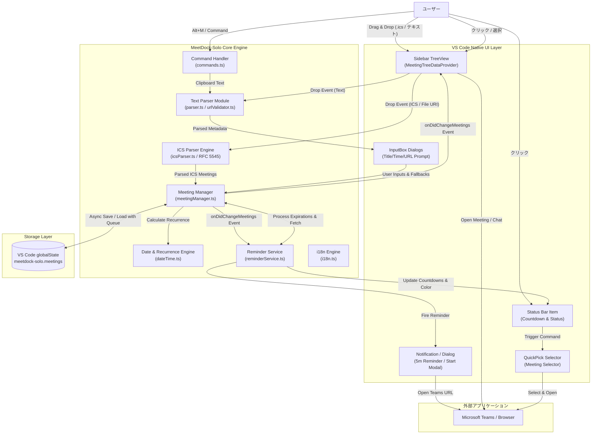
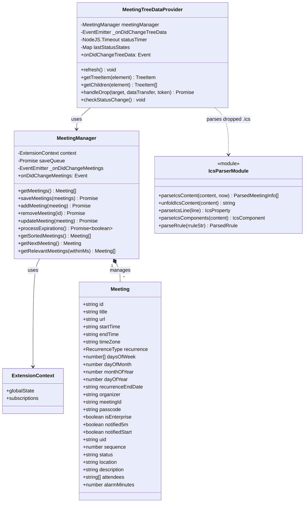

# アーキテクチャとシステム設計書 (Architecture & System Design)

このドキュメントは **MeetDock-Solo** の全体アーキテクチャ、設計思想、モジュール構成、データフロー、状態遷移および動的シーケンスを示す開発者・アーキテクト向けのドキュメントです。

---

## 1. 概要と成り立ち (Overview & Design Philosophy)

### 1.1 開発背景と成り立ち
コーディングや開発作業に集中している際、Microsoft Teams 等の会議開始時刻に気付かず遅刻・欠席してしまう問題を防ぐために **MeetDock-Solo** は誕生しました。

外部の重厚なカレンダー連携システムやクラウドAPI認証（OAuth）に依存せず、**「手軽に・軽量に・ローカル完結で」** 会議リマインダーを利用できることを最優先設計目標としています。

### 1.2 コア設計思想
1. **100% ローカルファースト & プライバシー保護**
   - クラウドサーバーや外部APIとの直接通信を行わず、すべての会議データは VS Code の `globalState` に暗号化/ローカル保存されます。
2. **VS Code Native UI の徹底活用**
   - Webview を用いず、VS Code 純正の `TreeView` (TreeDataProvider & TreeDragAndDropController) および `StatusBarItem`, `QuickPick` を活用することで、極めて軽量かつレスポンシブな動作を実現します。
3. **スマート解析・ICS対応・段階的補間 (Smart Parsing & Dynamic Interactive Interpolation)**
   - 個人向け Teams 招待文テキスト（クリップボードやD&D）からの抽出に加え、企業版 Teams / Outlook から保存した `.ics` ファイルの直接ドラッグ＆ドロップおよび RFC 5545 / RFC 6868 規格準拠解析に対応。Teams URL、タイトル、開始/終了日時、主催者、出席者、会議ID/パスコード、各種繰り返しルール（RRULE / EXDATE / RDATE / RECURRENCE-ID / CANCELLED）を自動抽出し、不足している情報のみを対話型ダイアログで補完します。
4. **マルチレベルのタイムリーなリマインド**
   - 5分前の情報通知 (Information Message)、開始時刻の全面ダイアログ (Modal Message)、および StatusBar のリアルタイムカウントダウン/ローテーション表示により見落としを防止します。

---

## 2. コンポーネント構成とデータフロー (Component Architecture & Data Flow)

### 2.1 コンポーネント構成図 (Component Diagram)

以下は、ユーザー入力・VS Code Native UI・内部コアモジュール・データ保存層・外部アプリケーション（Microsoft Teams）間の関係を示すコンポーネント図です。



### 2.2 ユーザー入力・ICS解析の格納場所と自動補間メカニズム

ユーザーが入力したデータやクリップボード/D&D経由（テキストおよび `.ics` ファイル）で取得した情報は、以下の流れで解析・補間され、`globalState` に永続化されます。

```
[ ユーザー入力 / D&Dテキスト / .ics ファイル / クリップボード ]
                     │
         ┌───────────┴───────────┐
         ▼                       ▼
  【 1a. ICS Parser (icsParser.ts) 】  【 1b. Text Parser (parser.ts) 】
  - RFC 5545 / RFC 6868 規格解析      - Outlook SafeLinks の自動解読・展開
  - UTF-8 / BOM / CRLF / Folding展開 - Teams 会議 URL / 主催者 / ID等の抽出
  - 優先順での Teams URL 抽出         - タイトル抽出 (Subject / 件名 / 招待文頭)
  - RRULE / EXDATE / RDATE 解析      - 日時・タイムゾーンの解析 (和暦・24H)
  - RECURRENCE-ID / CANCELLED 処理    - 繰り返しパターン (Daily/Weekly等) 判定
         │                       │
         └───────────┬───────────┘
                     ▼
      【 2. 不足情報の補間・デフォルト計算 (commands.ts / treeProvider.ts) 】
   - URL未検出時 ──> URL入力プロンプトを表示
   - タイトル未検出時 ──> デフォルト 'Teams Meeting' を補間
   - 開始日時未検出時 ──> 翌毎時00分を補間
   - 過去日時の場合 ──> 次回開催予定日へ自動繰り越し補間
   - 終了日時未指定時 ──> 開始時刻 + 30分を補完計算
                     │
                     ▼
       【 3. 永続化と状態通知 (meetingManager.ts) 】
   - JSONオブジェクト構造に変換し globalState にアトミック保存
   - Change Event を発行し TreeView と StatusBar を同期更新
```

---

## 3. モジュール構造とクラス設計 (Module Architecture & Class Diagram)

### 3.1 クラス・モジュール関係図 (Class Diagram)

MeetDock-Solo の主要クラスおよび各モジュール間の依存関係を示すクラス図です。



### 3.2 モジュール責務一覧

| モジュールファイル | 主要クラス / 関数 | 主な責務・役割 |
| :--- | :--- | :--- |
| **`src/extension.ts`** | `activate()`, `deactivate()` | 拡張機能のエントリーポイント。マネージャー群の初期化、コマンド・TreeView・ディスポーザブルの登録。 |
| **`src/meetingManager.ts`**| `MeetingManager`, `getNextOccurrence()` | 会議データの CRUD 操作、`globalState` へのアトミック保存 (Queue制御)、期限切れ会議の自動繰り越し計算。 |
| **`src/reminderService.ts`**| `ReminderService` | 10秒周期の監視タイマー制御、5秒周期の StatusBar 表示ローテーション、5分前/開始リマインダー通知の発火。 |
| **`src/treeProvider.ts`** | `MeetingTreeDataProvider`, `MeetingTreeItem` | サイドバー TreeView の表示データ構築、ドラッグ＆ドロップ (`handleDrop`) でのテキスト/.ics ファイル受取・自動登録。 |
| **`src/icsParser.ts`** | `parseIcsContent()`, `parseSingleVEvent()` | RFC 5545 / RFC 6868 規格に準拠した ICS ファイルの構造化解析、優先順による Teams URL 抽出、繰り返し・例外判定。 |
| **`src/parser.ts`** | `parseMeetingText()` | クリップボード/D&D等の任意招待文から URL、タイトル、日時、主催者、ID、繰り返し設定等を正規表現抽出。 |
| **`src/dateTime.ts`** | `createDateInTimeZone()`, `getZonedDateParts()` | タイムゾーン考慮型の日時計算、月末調整、日次/週次/月次/年次の加算ロジックを提供。 |
| **`src/urlValidator.ts`** | `isValidTeamsUrl()`, `openTeamsMeetingUrl()` | Teams URL の検証、Outlook SafeLinks の解読・展開、会議チャット URL への変換および外部ブラウザ起動。 |
| **`src/commands.ts`** | `addFromClipboardCommand()` | クリップボード経由での会議追加コマンド処理。ダイアログによる段階的な補間とバリデーション。 |
| **`src/i18n.ts`** | `t` (Translation function map) | `vscode.env.language` に基づく動的バイリンガル (日本語 / 英語) 文字列リソースの提供。 |

---
