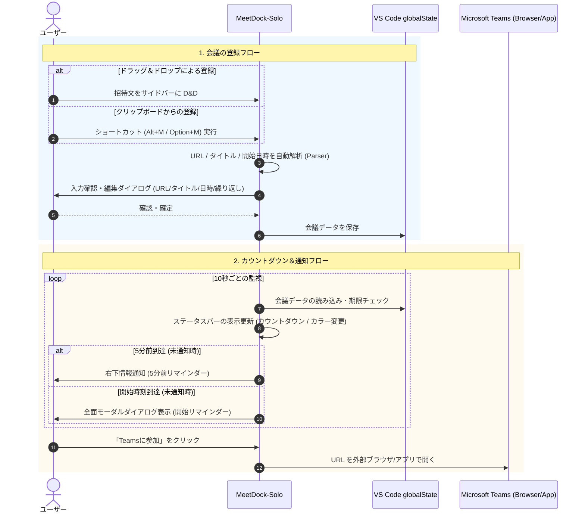
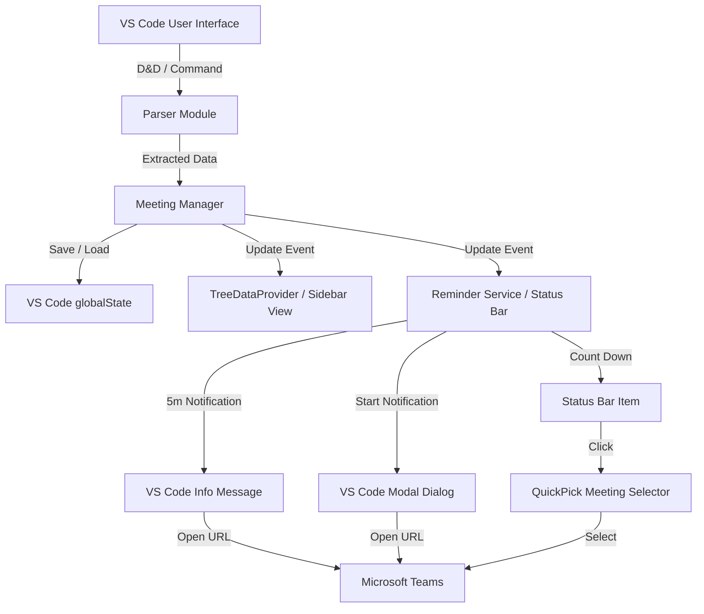

# アーキテクチャと動作フロー

このドキュメントは **MeetDock-Solo** の内部動作フローおよびコンポーネント構造を示す開発者向けの資料です。

---

## 🔄 動作フロー・システム構造

### 会議登録・通知フロー (Mermaid Sequence Diagram)

```mermaid
sequenceDiagram
    autonumber
    actor User as ユーザー
    participant Extension as MeetDock-Solo
    participant Storage as VS Code globalState
    participant Teams as Microsoft Teams (Browser/App)

    rect rgb(240, 248, 255)
    note over User, Storage: 1. 会議の登録フロー
    alt ドラッグ＆ドロップによる登録
        User->>Extension: 招待文をサイドバーに D&D
    else クリップボードからの登録
        User->>Extension: ショートカット (Alt+M / Option+M) 実行
    end
    Extension->>Extension: URL / タイトル / 開始日時を自動解析 (Parser)
    Extension->>User: 入力確認・編集ダイアログ (URL/タイトル/日時/繰り返し)
    User-->>Extension: 確認・確定
    Extension->>Storage: 会議データを保存
    end

    rect rgb(255, 250, 240)
    note over User, Teams: 2. カウントダウン＆通知フロー
    loop 10秒ごとの監視
        Extension->>Storage: 会議データの読み込み・期限チェック
        Extension->>Extension: ステータスバーの表示更新 (カウントダウン / カラー変更)
        alt 5分前到達 (未通知時)
            Extension->>User: 右下情報通知 (5分前リマインダー)
        else 開始時刻到達 (未通知時)
            Extension->>User: 全面モーダルダイアログ表示 (開始リマインダー)
        end
    end
    User->>Extension: 「Teamsに参加」をクリック
    Extension->>Teams: URL を外部ブラウザ/アプリで開く
    end
```

### 機能コンポーネント構造 (Mermaid Flowchart)

```mermaid
graph TD
    A[VS Code User Interface] -->|D&D / Command| B[Parser Module]
    B -->|Extracted Data| C[Meeting Manager]
    C -->|Save / Load| D[VS Code globalState]
    C -->|Update Event| E[TreeDataProvider / Sidebar View]
    C -->|Update Event| F[Reminder Service / Status Bar]
    F -->|Count Down| G[Status Bar Item]
    F -->|5m Notification| H[VS Code Info Message]
    F -->|Start Notification| I[VS Code Modal Dialog]
    H -->|Open URL| J[Microsoft Teams]
    I -->|Open URL| J
    G -->|Click| K[QuickPick Meeting Selector]
    K -->|Select| J
```
